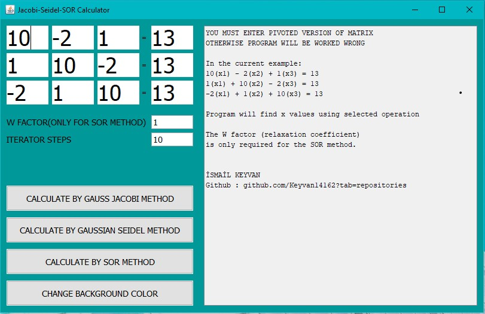

# JACOBI-SEIDEL-SOR-CALCULATOR
Calculate teh 3x3 matrixs with
-Gauss Jordan Method
-Gaussian Seidel Methaod
-SOR(Successive Over-Relaxation) Method

You can choose iteration step size and W factor for SOR method.
There is no application on internet for calculating this three in a row.(Maybe there is)
Also you can change background color :)

Just download and run the .jar file.

